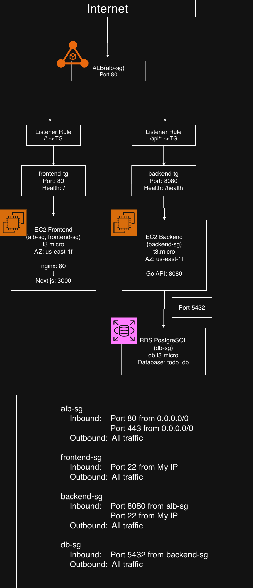

# todo-app-next-go

## 概要

Next.js と Go による Todo アプリケーション

## ディレクトリ構造

```bash
todo-app-next-go/
  ├── frontend/  # フロントエンドコード（Next.js）
  ├── backend/   # バックエンドコード（Go）
  └── docs/      # ドキュメント用図・画像・動画
```

## ローカル PC でのセットアップ

### 必要環境

- Node.js 20+
- yarn
- Go 1.25+
- PostgreSQL
- Docker
- make

#### 1. リポジトリのクローン

```bash
git clone https://github.com/Rtosshy/todo-app-next-go.git
cd todo-app-next-go
```

#### 2. Next.js サーバーの起動

```bash
cd frontend
yarn install
yarn dev
```

#### 3. バックエンド環境変数の設定

```bash
# 別のシェルを立ち上げて
cd backend
vi .env.development
```

以下の内容を入力

```env
DB_USER=app
DB_PASSWORD=password
DB_NAME=api_database
DB_HOST=localhost
DB_PORT=5432
DB_SSL_MODE=disable
```

#### 4. Go サーバーと PostgreSQL コンテナの起動

```bash
make external-up
make run
```

#### 5. Web ブラウザで動作確認

ブラウザのアドレスバーに`http://localhost:3000`を入力

## Frontend

### 概要

Next.js 16 (App Router) + React 19 による Todo アプリケーション

詳細は frontend/README.md をご覧ください
[frontend/README.md](./frontend/README.md)

## Backend

### 概要

Go + Clean Architecture による Todo API サーバー

詳細は backend/README.md をご覧ください
[backend/README.md](./backend/README.md)

## インフラ構成図


